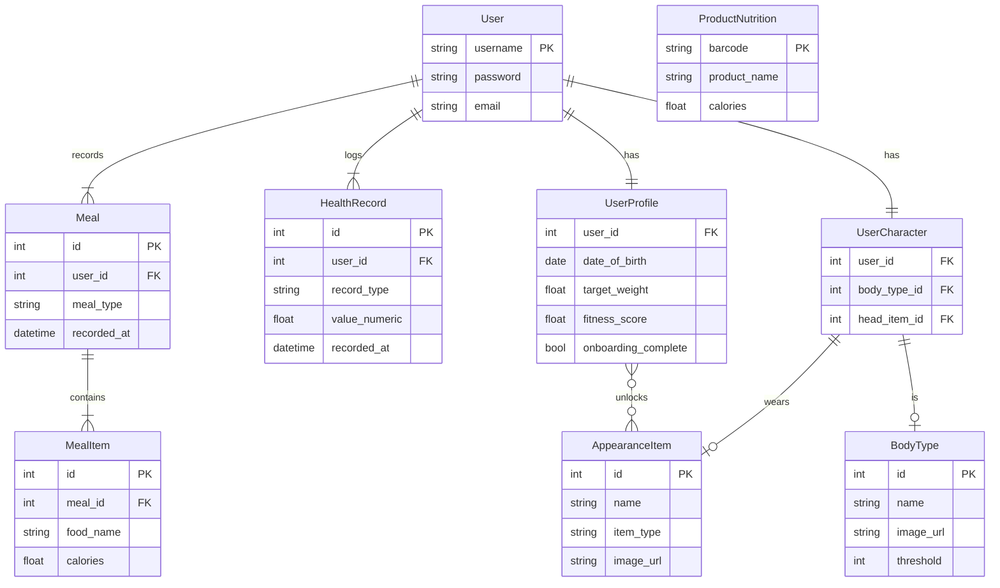

# データベース設計

## 1. 設計思想

* **関心の分離:** 認証情報 (`User`) と詳細プロフィール (`UserProfile`) を分離し、拡張性を確保しています。
* **正規化:** 食事記録は「食事の枠 (`Meal`)」と「個々の品目 (`MealItem`)」に分割し、データの重複を避けています。
* **キャッシュ戦略:** 外部APIから取得した商品情報は`ProductNutrition`モデルにキャッシュし、APIの呼び出し回数を削減しています。
* **モジュール性:** 各機能は独立したアプリとして設計されており、`ForeignKey`や`ManyToManyField`で疎結合されています。

## 2. モデル定義

| モデル名 (`アプリ名`) | 概要 |
| :--- | :--- |
| **User** (`auth`) | Django標準のユーザーモデル。ログインIDとパスワードを管理。 |
| **UserProfile** (`accounts`) | ユーザーの静的なプロフィール情報。目標、身体情報、性格診断結果、アンロック済みアイテム、フィットネススコアなどを保持。**User**と1対1の関係。 |
| **HealthRecord** (`health_records`) | 歩数、体重など、日時と共に記録されるデータ。**User**と多対1の関係。 |
| **Meal** (`meals`) | 「朝食」「昼食」といった食事の枠組み。**User**と多対1の関係。 |
| **MealItem** (`meals`) | 食事に含まれる個々の品目（例：ごはん、みそ汁）。栄養情報もここに記録。**Meal**と多対1の関係。 |
| **ProductNutrition** (`products`) | バーコード検索で取得した商品情報をキャッシュするテーブル。 |
| **BodyType** (`customization`) | キャラクターの体型（痩せ型、標準など）と、その体型になるための閾値、画像URLを管理。 |
| **AppearanceItem** (`customization`) | キャラクターが装備できるアイテム（帽子、靴など）のマスターデータ。 |
| **UserCharacter** (`customization`) | ユーザーが現在どの体型で、どのアイテムを装備しているかを管理。**User**と1対1の関係。 |

## 3. データベース概要図 (ERD)

